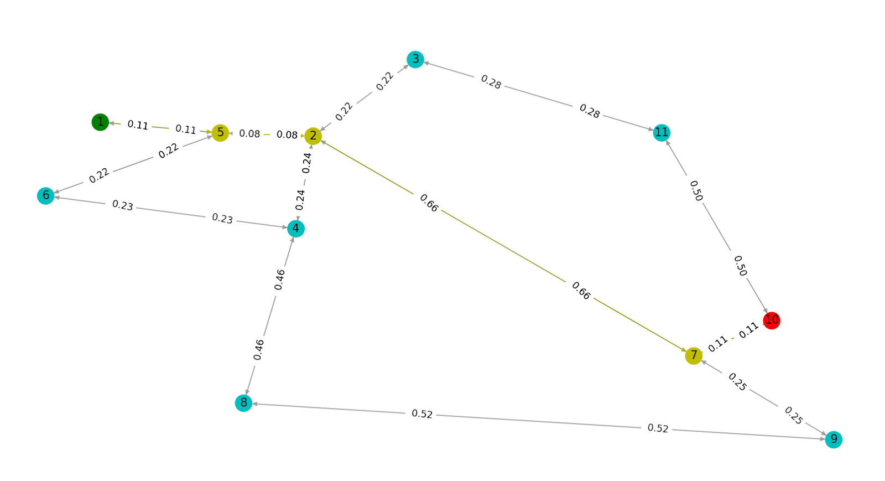
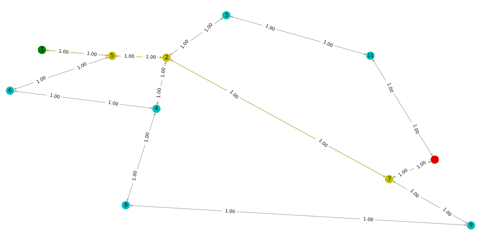

# Implementasi Algoritma UCS dan A* untuk Menentukan Lintasan Terpendek
## Tugas Kecil 3 - Strategi Algoritma 2022/2023

## **Table of Contents**
* [General Information](#general-information)
* [Requirements](#requirements)
* [How to Run the Program](#how-to-run-the-program)
* [How to Use the Program](#how-to-use-the-program)
* [Screenshots](#screenshots)
* [Authors](#authors)

## **General Information**
This program uses the UCS (Uniform Cost Search) and A* (or A star) algorithms to determine the shortest path from a starting point to a destination. The determination of the shortest path in this program uses a graph based on the Google Map of roads in Bandung city. In the graph used, nodes represent road intersections (3-way, 4-way or 5-way) or road ends. The weight of the graph represents the distance (km) between nodes. The distance between two nodes is calculated from the coordinates of both nodes using the Euclidean distance formula, Haversine distance formula (based on coordinates) or using a ruler on Google Map, or other methods provided by Google Map. The heuristic value used is the straight-line distance from a point to the destination.

This program is made to follow this [specification](https://drive.google.com/file/d/1PeEHJ_G-I4wB0lGxW-a8C5VmCgCF9XHR/view).

## **Requirements**
To use this program, you will need to install **Python3** (https://www.python.org/downloads/) on the device you are using.
You will also need to install `matplotlib` and `networkx` libraries.
```
pip install matplotlib
pip install networkx
```

## **How to Run the Program**
### **Setup**
1. Clone this repository <br>
```
git clone https://github.com/yuujin-Q/Tucil3_13521048_13521074.git
```
2. Open the cloned repository in terminal
### **Run**
1. To run the program, execute `run.bat` (Windows) or `run.sh` (Linux) located in the root of repository.
```
.\run.bat
```
or for Linux
```
sh ./run.sh
```

2. Alternatively, navigate to `src` directory and run
```
python main.py
```
or for Linux
```
python3 main.py
```

## **How to Use the Program**
1. Create a text file containing the graph configuration file in the `test` directory. The formatting for the files can be referred from the existing test files.
2. Run the program.
3. Input your choice of calculating the edge costs. 

If Haversine is selected, the edge cost between any two nodes will be calculated by coordinates of the two node based on the positive values of the matrix element. For example, with Haversine edge cost, the graph for `test1.txt` will be as shown.

Else, the edge cost between any two nodes will be as declared in the matrix of the configuration file. For example, following the declared matrix, the edge costs of the graph for `test1.txt` will be as shown.


4. Input your configuration file name.
5. Input your choice of search algorithm and your choices for the start and finish nodes.
6. The result will be printed and visualized.

## **Screenshots**
Below are example screenshots of the program in use. Note that the coloring for the node path is green for start node, yellow for path nodes, red for stop node, and cyan for other nodes. For the edge path, the coloring is yellow for solution edges and gray for non-solution edges.


## **Authors**

| **NIM**  |       **Name**                 | **Class**  |       
| :------: | :----------------------------: | :-------:  | 
| 13521048 |    M Farrel Danendra Rachim    | K02 |
| 13521074 |    Eugene Yap Jin Quan         | K02 |
